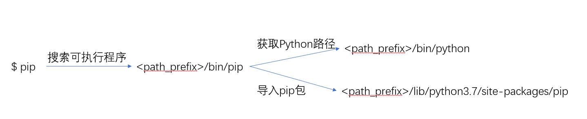

## Python的包管理及Pipenv

### @frostming

---?color=linear-gradient(90deg, #197CAA 50%, white 50%)

@snap[west span-50 text-white h3-white]
## Who Am I

- @fa[github](frostming)
- @fa[twitter](frostming90)
- @fa[qq](Tencent)
- 从 2014 年开始用 Python , 前测试，现开发
@snapend

@snap[east span-50]

Pipenv 维护者
@snapend

+++

队长别开抢，是我！

---

## 你是否遇到过这些问题

@ul
- 安装了包却提示导入失败
- Python 版本升级了，原有的命令行程序全体罢工
- 升级了某个库的版本，导致别的应用（库）挂了
@ulend

+++

+++

## Python 定位包位置的机制

- 到 `sys.prefix` 下面对应的 `Lib` 目录寻找包
- 所有 executable 均隐式对应一个 Python 解释器
- `pip` 亦将包安装到 `sys.prefix` 下面（默认配置下）
- `PYTHONPATH` 增加额外搜索路径

+++

## 使用virtualenv!

创建新的解释器，将 `path_prefix` 值改写

+++

## 几条最佳实践
@ul
- ❌ `sudo ln -sf /path/to/my/python /usr/bin/python`
- ❌ `sudo pip install <package>`
- ❌ 使用 homebrew 安装的 Python 安装命令行程序
- ✔ 每个命令行程序使用自己单独的虚拟环境，然后将 executable 软链到 `PATH` 中
- ✔ `pipx install <package>`
@ulend
